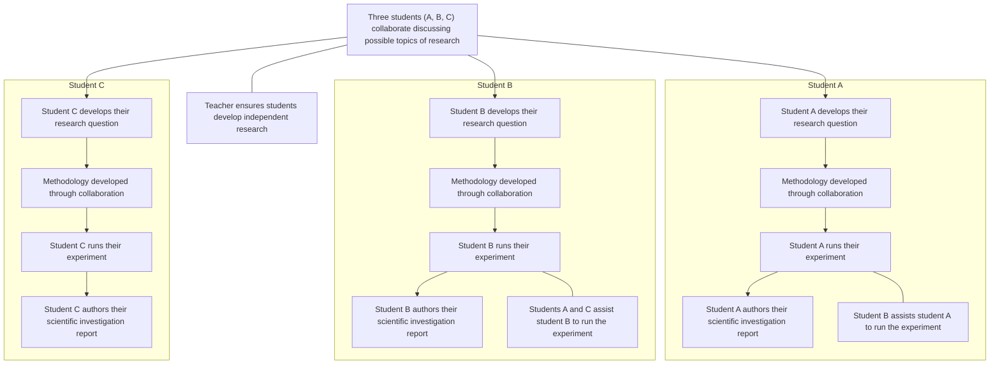

# Physics Internal assessment official guide

## Purpose of internal assessment

Internal assessment is an integral part of the course and is compulsory for both SL and HL students. It enables students to demonstrate the application of their skills and knowledge, and to pursue their personal interests, without the time limitations and other constraints that are associated with written examinations. The internal assessment should, as far as possible, be woven into normal classroom teaching and not be a separate activity conducted after a course has been taught. 

The internal assessment requirements at SL and at HL are the same. 

## Guidance and authenticity

The scientific investigation (SL and HL) submitted for internal assessment must be the student’s own work. However, it is not the intention that students should decide upon a title or topic and be left to work on the internal assessment component without any further support from the teacher. The teacher should play an important role during both the planning stage and the period when the student is working on the internally assessed work. It is the responsibility of the teacher to ensure that students are familiar with: 

• the requirements of the type of work to be internally assessed 

• the Sciences experimentation guidelines publication 

the assessment criteria. Students must understand that the work submitted for assessment must address these criteria effectively. 

Teachers and students must discuss the internally assessed work. Students should be encouraged to initiate discussions with the teacher to obtain advice and information, and students must not be penalized for seeking guidance. As part of the learning process, teachers should read and give advice to students on one draft of the work. The teacher should provide oral or written advice on how the work could be improved, but not edit the draft. The next version handed to the teacher must be the final version for submission. 

It is the responsibility of teachers to ensure that all students understand the basic meaning and significance of concepts that relate to academic integrity, especially authenticity and intellectual property. Teachers must ensure that all student work for assessment is prepared according to the requirements and must explain clearly to students that the internally assessed work must be entirely their own. Where collaboration between students is permitted, it must be clear to all students what the difference is between collaboration and collusion. 

All work submitted to the IB for moderation or assessment must be authenticated by a teacher, and must not include any known instances of suspected or confirmed malpractice. Each student must confirm that the work is their authentic work and constitutes the final version of that work. Once a student has officially submitted the final version of the work, it cannot be retracted. The requirement to confirm the authenticity of work applies to the work of all students, not just the sample work that will be submitted to the IB for the purpose of moderation. For further details, refer to the IB publications Academic integrity policy, Diploma Programme: From principles into practice and the relevant general regulations (in Diploma Programme Assessment procedures). 

Authenticity may be checked by discussion with the student on the content of the work, and by scrutiny of one or more of the following. 

• The student’s initial proposal 

• The first draft of the written work 

• The references cited 

• The style of writing compared with work known to be that of the student 

The analysis of the work by a web-based plagiarism detection service such as www.turnitin.com The same piece of work cannot be submitted to meet the requirements of both the IA and the EE. 

## Time allocation

Internal assessment is an integral part of the physics course, contributing 20% to the final assessment in the SL and the HL courses. This weighting should be reflected in the time that is allocated to teaching the knowledge, skills and understanding required to undertake the work, as well as the total time allocated to carry out the work. 

It is recommended that a total of approximately 10 hours (SL and HL) of teaching time should be allocated to the work. This should include: 

• time for the teacher to explain to students the requirements of the internal assessment 

• class time for students to work on the internal assessment component and ask questions 

• time for consultation between the teacher and each student 

time to review and monitor progress, and to check authenticity. 

## Safety requirements and recommendations

It is the responsibility of everyone involved in science education to make an ongoing commitment to safe and healthy practical work. 

The working practices and protocols should be effective in safeguarding students and protecting the environment. Schools are responsible for following national or local guidelines, which differ from country to country. The Physics teacher support material provides some further guidance. 

## Using assessment criteria for internal assessment

For internal assessment, a number of assessment criteria have been identified. Each assessment criterion has level descriptors describing specific achievement levels, together with an appropriate range of marks. The level descriptors concentrate on positive achievement, although for the lower levels failure to achieve may be included in the description. 

Teachers must judge the internally assessed work at SL and at HL against the criteria using the level descriptors. 

The same assessment criteria are provided for SL and HL. 

The aim is to find, for each criterion, the descriptor that conveys most accurately the level attained by the student, using the best-fit model. A best-fit approach means that compensation should be made when a piece of work matches different aspects of a criterion at different levels. The mark awarded should be one that most fairly reflects the balance of achievement against the criterion. It is not necessary for every single aspect of a level descriptor to be met for that mark to be awarded. 

When assessing a student’s work, teachers should read the level descriptors for each criterion until they reach a descriptor that most appropriately describes the level of the work being assessed. If a piece of work seems to fall between two descriptors, both descriptors should be read again and the one that more appropriately describes the student’s work should be chosen. 

Where there are two marks available within a level, teachers should award the upper marks if the student’s work demonstrates the qualities described to a great extent; the work may be close to achieving marks in the level above. Teachers should award the lower marks if the student’s work demonstrates the qualities described to a lesser extent; the work may be close to achieving marks in the level below. 

• Only whole numbers should be recorded; partial marks (fractions and decimals) are not acceptable. 

Teachers should not think in terms of a pass or fail boundary but should concentrate on identifying the appropriate descriptor for each assessment criterion. 

The highest level descriptors do not imply faultless performance but should be achievable by a student. Teachers should not hesitate to use the extremes if they are appropriate descriptions of the work being assessed. 

A student who attains a high achievement level in relation to one criterion will not necessarily attain high achievement levels in relation to the other criteria. Similarly, a student who attains a low achievement level for one criterion will not necessarily attain low achievement levels for the other criteria. Teachers should not assume that the overall assessment of the students will produce any particular distribution of marks. 

It is recommended that the assessment criteria be made available to students. 

## Internal assessment details—SL and HL

## The scientific investigation

## Duration: 10 hours

## Weighting: 20%

The IA requirement is the same for biology, chemistry and physics. The IA, worth 20% of the final assessment, consists of one task—the scientific investigation. 

The scientific investigation is an open-ended task in which the student gathers and analyses data in order to answer their own formulated research question. 

The outcome of the scientific investigation will be assessed through the form of a written report. The maximum overall word count for the report is 3,000 words. 

The following are not included in the word count. 

• Charts and diagrams 

• Data tables 

• Equations, formulas and calculations 

• Citations/references (whether parenthetical, numbered, footnotes or endnotes) 

• Bibliography 

• Headers 

The following details should be stated at the start of the report. 

• Title of the investigation 

IB candidate code (alphanumeric, for example, xyz123) 

• IB candidate code for all group members (if applicable) 

• Number of words 

There is no requirement to include a cover page or a contents page. 

## Facilitating the scientific investigation

The research question should be of interest to the student, but it is not necessary that it encompasses concepts beyond those described by the understandings within the guide. 

The scientific investigation undertaken must have sufficient extent and depth to allow for all the descriptors of the assessment criteria to be meaningfully addressed. 

The investigation of the research question must involve the collection and analysis of quantitative data that should be supported by qualitative observations where appropriate. 

The scientific investigation allows a wide range of techniques for data gathering and analysis to be employed. The approaches that could be used in isolation or in conjunction with each other are as follows. 

• Hands-on practical laboratory work 

• Fieldwork 

• Use of a spreadsheet for analysis and modelling 

• Extraction and analysis of data from a database 

• Use of a simulation. 

The Physics teacher support material contains further guidance on these possible approaches. 

## Teachers must:

ensure that students are familiar with the assessment criteria 

ensure that students are able to investigate their individual research question 

counsel the students on whether their proposed methodology is feasible in consideration of available time and resources 

ensure that students have given appropriate consideration to safety, ethical and environmental factors before undertaking the action phase 

remind students of the requirements for academic integrity and the consequences of academic malpractice. The difference between collaboration and collusion must be made clear. 

## Developing the research question

Each student is expected to formulate, investigate and answer a unique research question, seeking advice from their teacher. 

A student must not present the same set of raw data as another student. 

## Methodology for individual work

Each student develops their own methodology to answer their individual research question. The student investigates by: 

• manipulating an independent variable 

or

• selecting variables during fieldwork 

or

• selecting different data from external databases. 

The student might seek support from peers when collecting data. 

## Methodology for collaborative work

Collaborative work is optional and where it is facilitated the groups formed must be no larger than three students. Students may organize their own groups. The teacher must provide guidance to ensure that all students are fully engaged in the collaborative activity. Students must clearly understand the requirement to conduct an individual investigation. 

The methodology developed to answer their individual research question may be in part the outcome of collaborative activity. A student within the group investigates their individual research question by manipulating: 

• a different independent variable from those selected by other group members 

or 

• the same independent variable with a different dependent variable from those selected by other group members 

or

• different data from those selected by other group members from within a larger communally acquired data set. 

In this context, collaborative work is permitted under the understanding that the final report presented for assessment is that of the individual student. A report by the group is not permitted. All authoring, including the description of the methodology, must be done individually. This diagram illustrates a possible route through the IA process where students collaborate. 

## Class collaboration to set up a database

A school may take part in a large-scale activity collecting data to generate a database using standardized protocols. If a student decides to utilize this database in order to answer their research question, then the investigation must be treated as a database investigation. In such a case the methodology should be focused on the way the data is filtered and sampled from the whole database in the same way as if the data was wholly acquired from an external source. 

## Assessing the scientific investigation

The performance in IA at both SL and HL is marked against common assessment criteria, with a total mark out of 24. Student work is internally assessed by the teacher and externally moderated by the IB. 

The four assessment criteria are as follows. 

- Research design
- Data analysis 
- Conclusion 
- Evaluation 

Each assessment criterion has level descriptors describing specific achievement levels, together with an appropriate range of marks. The level descriptors concentrate on positive achievement, although for the lower levels failure to achieve may be included in the description. 

Teachers must judge the internally assessed work at SL and at HL against the same criteria using the level descriptors and aided by the clarifications. The criteria must be applied systematically using a best-fit approach—when a piece of work matches different aspects of a criterion at different levels the mark awarded should be one that most fairly reflects the balance of achievement against the criterion. It is not necessary for every single aspect of a level descriptor to be met for that mark to be awarded. The highest level descriptors do not imply faultless performance. 

Where there are two or more marks available within a level, teachers should award the upper mark if the student’s work largely satisfies the qualities described; the work may be close to achieving marks in the level above. Teachers should award the lower marks if the student’s work demonstrates the qualities described to a lesser extent; the work may be close to achieving marks in the level below. 

Only whole numbers must be recorded; partial marks (fractions and decimals) are not acceptable. 

The criteria should be considered independently. A student who attains a high achievement level in relation to one criterion will not necessarily attain high achievement levels in relation to the other criteria. Similarly, a student who attains a low achievement level for one criterion will not necessarily attain low achievement levels for the other criteria. Teachers should not assume that the overall assessment of the students will produce any particular distribution of marks. 

Where command terms are used in the level descriptors, they are to be interpreted as indicated in the “Glossary of command terms” section of this guide. These command terms indicate the depth of treatment required. Command terms used within the descriptors are provided in the following table. 

<table><tr><td>Assessment objective</td><td>Command term</td><td>Descriptor</td></tr><tr><td>AO1</td><td>State</td><td>Give a specific name, value or other brief answer without explanation or calculation.</td></tr><tr><td>AO2</td><td>Identify</td><td>Provide an answer from a number of possibilities.</td></tr><tr><td>AO2</td><td>Outline</td><td>Give a brief account or summary.</td></tr><tr><td>AO2</td><td>Describe</td><td>Give a detailed account.</td></tr><tr><td>AO3</td><td>Explain</td><td>Give a detailed account including reasons or causes.</td></tr><tr><td>AO3</td><td>Justify</td><td>Give valid reasons or evidence to support an answer or conclusion.</td></tr></table>

## Referencing and academic integrity

Appropriate referencing to sourced information used in the report of the scientific investigation is expected. Omitted or improper referencing will be considered to be academic malpractice. 

Students must ensure their assessment work adheres to the IB’s academic integrity policy and that all sources are appropriately referenced. A student’s failure to appropriately acknowledge a source will be investigated by the IB as a potential breach of regulations that may result in a penalty imposed by the IB Final Award Committee. See the “Academic integrity” section of this guide for full details. 

## Internal assessment criteria—SL and HL

Download: Internal assessment criteria—SL and HL (PDF) 

There are four IA criteria for the scientific investigation. The marks and weightings are as follows. 

<table><tr><td>Criterion</td><td>Maximum number of marks available</td><td>Weighting (%)</td></tr><tr><td>Research design</td><td>6</td><td>25</td></tr><tr><td>Data analysis</td><td>6</td><td>25</td></tr><tr><td>Conclusion</td><td>6</td><td>25</td></tr><tr><td>Evaluation</td><td>6</td><td>25</td></tr><tr><td>Total</td><td>24</td><td>100</td></tr></table>

## Research design

This criterion assesses the extent to which the student effectively communicates the methodology (purpose and practice) used to address the research question. 

<table><tr><td>Marks</td><td>Level descriptor</td></tr><tr><td>0</td><td>The report does not reach the standard described by the descriptors below.</td></tr><tr><td>1–2</td><td>The research question is stated without context.Methodological considerations associated with collecting data relevant to the research question are stated.The description of the methodology for collecting or selecting data lacks the detail to allow for the investigation to be reproduced.</td></tr><tr><td>3–4</td><td>The research question is outlined within a broad context.Methodological considerations associated with collecting relevant and sufficient data to answer the research question are described.The description of the methodology for collecting or selecting data allows for the investigation to be reproduced with few ambiguities or omissions.</td></tr><tr><td>5–6</td><td>The research question is described within a specific and appropriate context.Methodological considerations associated with collecting relevant and sufficient data to answer the research question are explained.The description of the methodology for collecting or selecting data allows for the investigation to be reproduced.</td></tr></table>

## Clarifications for research design

A research question with context should contain reference to the dependent and independent variables or two correlated variables, include a concise description of the system in which the research question is embedded, and include background theory of direct relevance. 

Methodological considerations include: 

• the selection of the methods for measuring the dependent and independent variables 

• the selection of the databases or model and the sampling of data 

the decisions regarding the scope, quantity and quality of measurements (e.g. the range, interval or frequency of the independent variable, repetition and precision of measurements) 

• the identification of control variables and the choice of method of their control 

the recognition of any safety, ethical or environmental issues that needed to be taken into account. The description of the methodology refers to presenting sufficiently detailed information (such as specific materials used and precise procedural steps) while avoiding unnecessary or repetitive information, so that 

<table><tr><td>Clarifications for research design</td></tr><tr><td>the reader may readily understand how the methodology was implemented and could in principle repeat the investigation.</td></tr></table>

## Data analysis

This criterion assesses the extent to which the student’s report provides evidence that the student has recorded, processed and presented the data in ways that are relevant to the research question. 

<table><tr><td>Marks</td><td>Level descriptor</td></tr><tr><td>0</td><td>The report does not reach a standard described by the descriptors below.</td></tr><tr><td>1–2</td><td>The recording and processing of the data is communicated but is neither clear nor precise.The recording and processing of data shows limited evidence of the consideration of uncertainties.Some processing of data relevant to addressing the research question is carried out but with major omissions, inaccuracies or inconsistencies.</td></tr><tr><td>3–4</td><td>The communication of the recording and processing of the data is either clear or precise.The recording and processing of data shows evidence of a consideration of uncertainties but with some significant omissions or inaccuracies.The processing of data relevant to addressing the research question is carried out but with some significant omissions, inaccuracies or inconsistencies.</td></tr><tr><td>5–6</td><td>The communication of the recording and processing of the data is both clear and precise.The recording and processing of data shows evidence of an appropriate consideration of uncertainties.The processing of data relevant to addressing the research question is carried out appropriately and accurately.</td></tr></table>

<table><tr><td>Clarifications for data analysis</td></tr><tr><td>Data refers to quantitative data or a combination of both quantitative and qualitative data.CommunicationClear communication means that the method of processing can be understood easily.Precise communication refers to following conventions correctly, such as those relating to the annotation of graphs and tables or the use of units, decimal places and significant figures.Consideration of uncertainties is subject specific and further guidance is given in thePhysics teacher support material.Major omissions, inaccuracies or inconsistencies impede the possibility of drawing a valid conclusion that addresses the research question.Significant omissions, inaccuracies or inconsistencies allow the possibility of drawing a conclusion that addresses the research question but with some limit to its validity or detail.</td></tr></table>

## Conclusion

This criterion assesses the extent to which the student successfully answers their research question with regard to their analysis and the accepted scientific context. 

<table><tr><td>Marks</td><td>Level descriptor</td></tr><tr><td>0</td><td>The report does not reach a standard described by the descriptors below.</td></tr><tr><td>1–2</td><td>A conclusion is stated that is relevant to the research question but is not supported by the analysis presented.The conclusion makes superficial comparison to the accepted scientific context.</td></tr><tr><td>3–4</td><td>A conclusion is described that is relevant to the research question but is not fully consistent with the analysis presented.A conclusion is described that makes some relevant comparison to the accepted scientific context.</td></tr><tr><td>5–6</td><td>A conclusion is justified that is relevant to the research question and fully consistent with the analysis presented.A conclusion is justified through relevant comparison to the accepted scientific context.</td></tr></table>

## Clarifications for conclusion

A conclusion that is fully consistent requires the interpretation of processed data including associated uncertainties. 

Scientific context refers to information that could come from published material (paper or online), published values, course notes, textbooks or other outside sources. The citation of published materials must be sufficiently detailed to allow these sources to be traceable. 

## Evaluation

This criterion assesses the extent to which the student’s report provides evidence of evaluation of the investigation methodology and has suggested improvements. 

<table><tr><td>Marks</td><td>Level descriptor</td></tr><tr><td>0</td><td>The report does not reach a standard described by the descriptors below.</td></tr><tr><td>1–2</td><td>The report states generic methodological weaknesses or limitations.Realistic improvements to the investigation are stated.</td></tr><tr><td>3–4</td><td>The report describes specific methodological weaknesses or limitations.Realistic improvements to the investigation that are relevant to the identified weaknesses or limitations, are described.</td></tr><tr><td>5–6</td><td>The report explains the relative impact of specific methodological weaknesses or limitations.Realistic improvements to the investigation, that are relevant to the identified weaknesses or limitations, are explained.</td></tr></table>

<table><tr><td>**Clarifications for evaluation**</td></tr><tr><td>Generic is general to many methodologies and not specifically relevant to the methodology of the investigation being evaluated.</td></tr><tr><td>Methodological refers to the overall approach to the investigation of the research question as well as procedural steps.</td></tr><tr><td>Weaknesses could relate to issues regarding the control of variables, the precision of measurement or the variation in the data.</td></tr><tr><td>Limitations could refer to how the conclusion is limited in scope by the range of the data collected, the confines of the system or the applicability of assumptions made. </td></tr></table>

# Physics IA Format and Structure 

The guide will be broken up by section to help you better understand what is required in each part of the IA and will have examples linked (in green), as follows: 

## Introduction:

1. Include a brief overview of the topic and its importance - what is the concept being studied (eg: refractive index, resonant frequency, resistance). Where/how is it used? 

2. State the personal or global significance of the topic - what made you choose this and why is it an important topic to investigate? 

3. Briefly introduce the main device used in the experiment and state why this is the most appropriate method to use for the experiment (for example, inclined plane, parachute, copper wire, etc). 

4. The introduction should be around 0.5 - 1 page. 

5. Example: This IA has a good introduction since it briefly introduces the main concept being studied (damping), as well as the global significance of the uses of damping such as swinging doors and amusement park rides, and the introduction is around 0.5 pages long. 

## Research question:

1. State the main research question of the experiment including the independent and dependent variables. 

2. Make sure to include units for the independent and dependent variables. 

3. Include how the dependent variable will be quantified and measured (instrument name). Explain why this instrument is best for the respective dependent variable. 

4. An example research question should look like this: "To what extent does the salt concentration of water (1, 2, 3, 4, 5 mol/L) affect its specific heat capacity (in ${ \mathsf { J } } / { \mathsf { g } } ^ { \circ } { \mathsf { C } } )$ , as measured by a calorimeter?" 

5. Example: This IA has a good research question as it clearly states the research question and the units of the independent and dependent variables. 

## Background information:

1. Describe the physics behind the main concept being analyzed. Talk about what physical properties are involved in the process (eg: why does salt affect specific heat capacity, why does the diameter of a parachute affect terminal velocity, etc). 

2. Discuss the main method used to measure the concept of interest (eg: calorimetry to measure specific heat capacity). What aspects of this method make it suitable to measure the concept being studied? 

3. Include any equations that are relevant to the reactions that will occur during the experiment (if applicable). 

4. You should justify why the respective method of analysis was chosen for this experiment, for example, why calorimetry? What makes it suitable to answer the research question? 

5. If the research is based on secondary data, you should explain the selection of the database used and the method of data sampling used in the secondary data. Explain why this particular database interests you and why it is relevant to answering the posed research question. 

6. All the background information included should be directly focused on the research question. For example for specific heat capacity analysis, you can briefly talk about the structure and polarity of NaCl and how this affects its solubility, but don't spend more than 3-4 sentences talking about salt rather than the physics behind the experiment, which would be discussing specific heat capacity and calorimetry. 

7. Include relevant diagrams if applicable. Don't forget to provide a figure caption and cite the source of the diagram. 

8. Include in-text citations throughout the background information section. 

9. Example: This IA has good background information since it describes the main concept being studied (pendulum damping), and provides the relevant equations for the mechanism occurring. It includes relevant diagrams such as the forces on a pendulum and the angular displacement over time. The background information section is directly focused on the research question and contains in-text citations where applicable. 

## Variables:

1. Include the independent variable and units. Describe why the range of independent variables was chosen. For example, why was the height that a parachute is dropped chosen as 10-50cm instead of 50-100cm? You should justify why you have chosen specific values over others. 

2. Include the dependent variable, units, instrument with which it will be measured, and the uncertainty. For example in calorimetry, you could write "Dependent variable: specific heat capacity, measured using a calorimeter (±0.1 J/g°C)". 

3. Add a table of control variables, including how each variable is controlled and why it is controlled. 

4. Example: This IA has a good variables section since the independent variable is clearly stated with its units, the dependent variable is stated with its units and how it will be measured, and a section of control variables is present that states why and how each variable will be controlled. 

## Diagram and Apparatus:

1. Create a list of all the apparatus and equipment used in the experiment. 

2. Ensure to include uncertainties for all relevant instruments (eg: thermometer, ammeter, voltmeter, weighing balances, etc). 

3. Include the concentrations of all standard solutions used. 

4. Include a labelled image of the experimental setup (however you could also include an image in the method section). 

5. Example: All glassware and equipment are stated with their respective uncertainties. 

## Method:

1. Write down each step of the method exactly as it was performed in the lab. 

2. Use a narrative tone when writing the method and not a first-person tone. For example, you should write "Prepare a solution of ....." rather than writing "I prepared a solution of......". 

3. Include a risk assessment table at the end of the method, outlining the safety, ethical and environmental concerns of the experiment. 

4. Example: All steps of the method are accurately noted down in the narrative tone and no first-person voice has been used. A risk assessment section has been included at the end which accounts for safety, ethical and environmental concerns. 

## Results: (Raw data, Processed data, Graph)

1. Include a table of the processed data from the experiment. Include a number and caption for the table and ensure the data is centred in the cells. 

2. Add a section for qualitative data if applicable (eg: colour changes, temperature changes). 

3. Ensure all data in tables has the appropriate number of significant figures and decimal places. 

4. Include a sample equation and calculation showing how the data is processed. Do this for each type of calculation used (eg: calculating averages, calculating resistance, etc). 

5. Place the rest of the processed data in a new processed data table. Include a number and caption for the table and ensure the data is centred in the cells. 

6. Include a sample calculation for the propagation of uncertainties, and place the rest of the uncertainties for the other values in a table with a caption. After calculating the uncertainties, include a description of what they mean concerning the data. Is the uncertainty small or large? What does this mean about the error and validity of the results? 

7. Include a graph of the processed data versus the independent variable. Include a graph title, axis titles and units, and provide a figure caption for the graph. Include a paragraph below the graph describing the trends in the data such as the correlation if linear (positive or negative) and the R^2 value. 

8. Example: A table of qualitative data, raw data and processed data has been included. All tables have a number and figure caption. Sample calculations are shown for each type of equation used. An appropriate graph has been included. 

## Analysis and Conclusion:

1. State the aim of the experiment to refresh the reader's memory. 

2. Discuss the trends in the graph and how they correspond to the research question. 

3. Use experimental values from the analysis section in the conclusion. For example, instead of just saying that specific heat capacity decreases as salt concentration increases, you could say that the specific heat capacity decreases from 4.5 J/g°C to 2.5 J/g°C as the salt concentration increases from 1 M to 5 M. 

4. Discuss the extent to which the research question was answered - was it answered fully or only partially? 

5. Discuss the R^2 value of the graph (if the data is linear) and how it describes the strength of the relationship between the independent and dependent variables. 

6. Describe if there are any anomalies in the data, and give reasons as to why these may have occurred. 

7. Compare your experimental values to literature values to strengthen your conclusion. Include in-text citations for the literature source. 

8. Discuss the impact of uncertainties - were they a significant amount of the experimental values? (For example, 10g ± 0.01g is more acceptable than 10g ± 1g) 

9. Example: The conclusion clearly re-states the aim of the essay, as well as a statement to which the research question has been answered (results support the hypothesis). Graphical trends and uncertainties are discussed in relation to the research question, such as the relationship between the variables. The reliability of the data was also discussed. 

## Evaluation:

1. Critically evaluate the results of the experiment and how they could be improved. 

2. Include a list of the strengths of the experiment and the significance of each strength. 

3. Include a table of the weaknesses of the experiment, as well as how they impacted the results and how to improve this in future. 

4. Make sure to account for random, systematic and human errors in the experiment, how they affected the data, and how this can be corrected in future. 

5. Finally, provide some extensions for the experiment. These should be some topics that relate to or build off the main topic. For example, for the analysis of parachute diameter on terminal velocity, you could say how in future you could keep the diameter the same and change the weight of the object tied to the parachute. You could also discuss what would happen if some of the control variables of the experiment were used as the dependent variables instead. 

6. Example: A table of strengths and weaknesses is included, along with considerations for random and systematic error. Extensions have also been provided for the experiment. 

## References:

1. Include a full list of all the references used in the IA. 

2. Ensure the bibliography is in the same citation style used in the introduction and background information section. 

3. Example: A full reference list has been included and is in the same citation style as used in the introduction and background information sections. 